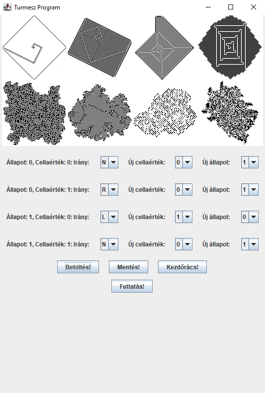
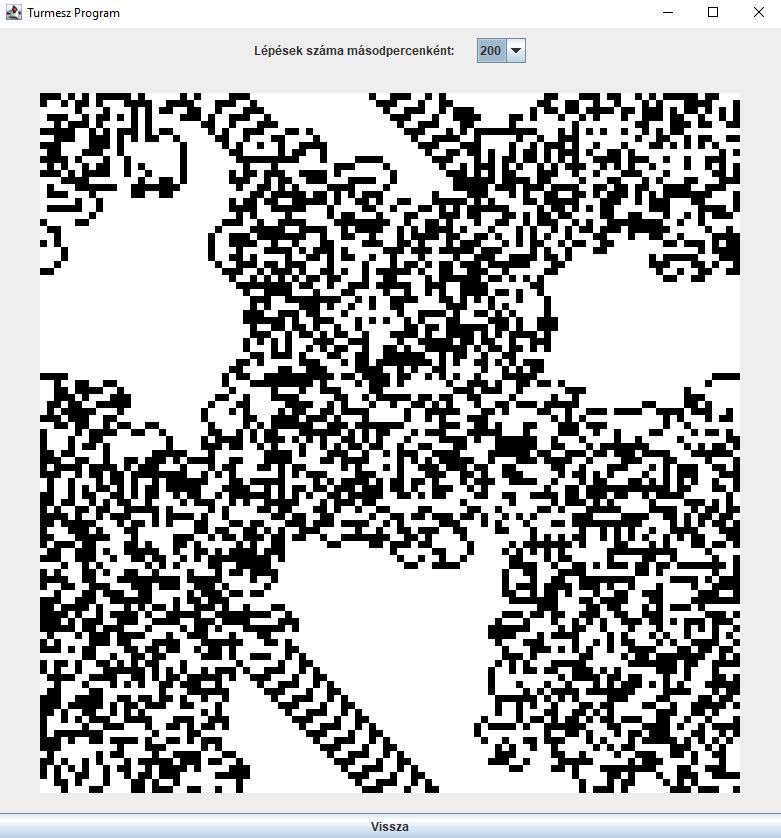

# Turmite-Nagyhazi

A Turmesz program egy 2D Turing-gépet (Turmite) szimulál, amely egy 2D rácsot használ állapotok, 
cellák és irányok alapján. A program célja, hogy lehetővé tegye a felhasználók számára Turmesz
gépek létrehozását és futtatását, valamint a generált mintázatok megjelenítését.

A projekt részletes specifikációját PDF formátumban [itt](./NHF%20specifikáció%20-%20Benedek%20Olivér.pdf) olvashatja, valamint a felhasználói dokumentációt [itt](./Felhasználói%20dokumentáció.pdf) tekintheti meg.

A menü előnézete:

  

A turmesz előnézete:

  

A projekt UML diagramja:

  

